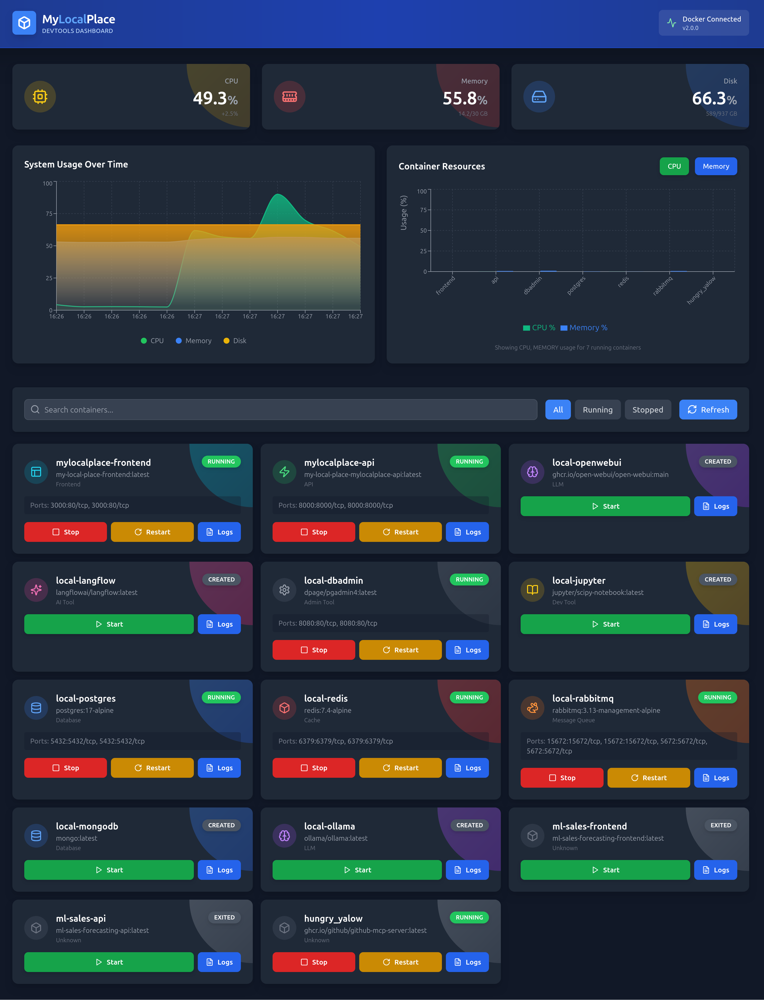

# MyLocalPlace v2.0 - DevTools Dashboard

[](https://fastapi.tiangolo.com)
[](https://react.dev)
[](https://docker.com)
[](https://python.org)
[](https://typescriptlang.org)
[](https://pytest.org)
[](https://coverage.readthedocs.io)

> **Full-stack Dashboard for managing local Docker containers and development services**

Modern web dashboard built with FastAPI (backend) and React + TypeScript (frontend) for managing Docker containers. Features real-time monitoring, resource alerts, and comprehensive container management.



## Features

### Backend API
- REST API for Docker container management
- Real-time container statistics (CPU, RAM, Network)
- Resource usage monitoring and alerts
- Container logs with timestamp streaming
- Volume management and cleanup
- System metrics (CPU, Memory, Disk)

### Frontend Dashboard
- Modern React UI with TailwindCSS
- Real-time container status display
- Interactive controls (start, stop, restart)
- Live log viewer
- Resource usage charts with Recharts
- Dark mode support
- Responsive design
- Container type icons with color classification

### Infrastructure
- Unified Docker environment
- 9 pre-configured services (Postgres, Redis, MongoDB, RabbitMQ, Ollama, etc.)
- Systemd autostart capability
- LLM support (Qwen2.5-Coder 3B installed)

## Tech Stack

### Backend
- **Framework**: FastAPI 0.115
- **Docker**: Python SDK 7.1
- **Language**: Python 3.13
- **Validation**: Pydantic 2.10
- **Server**: Uvicorn 0.32
- **Testing**: pytest + httpx + coverage (92.28%)
- **Tools**: psutil, websockets

### Frontend
- **Framework**: React 18 + Vite 6
- **Language**: TypeScript 5
- **Styling**: TailwindCSS 3
- **Charts**: Recharts 2
- **HTTP Client**: Axios
- **Icons**: Lucide React
- **Build**: Multi-stage Docker + Nginx

### Architecture
- **Pattern**: Repository Pattern
- **Code Quality**: PEP8, isort, black, flake8
- **Testing**: Function-based, 69 tests, 92% coverage
- **Deployment**: Docker Compose with profiles

## Quick Start

### Prerequisites

- Docker 24+
- Docker Compose 2+
- Make

### Installation

```bash
git clone https://github.com/LucasBiason/my-local-place.git
cd my-local-place

# Note your installation path for systemd configuration
pwd
```

### Run

```bash
# Start API + create all services (not started)
make up

# Start API + Frontend (full stack)
make up-full

# Run tests
make test

# Stop all
make down
```

### Access

- **Frontend Dashboard**: http://localhost:3000
- **Backend API**: http://localhost:8000
- **API Docs**: http://localhost:8000/docs
- **ReDoc**: http://localhost:8000/redoc

## API Endpoints

### Health
- `GET /health` - Health check

### Containers
- `GET /api/v1/containers` - List all containers
- `GET /api/v1/containers/{name}` - Get container details
- `POST /api/v1/containers/{name}/start` - Start container
- `POST /api/v1/containers/{name}/stop` - Stop container
- `POST /api/v1/containers/{name}/restart` - Restart container
- `GET /api/v1/containers/{name}/logs` - Get container logs
- `GET /api/v1/containers/{name}/stats` - Get container stats

### System
- `GET /api/v1/system/metrics` - System metrics (CPU, RAM, Disk)

### Alerts
- `GET /api/v1/alerts` - Get resource alerts and warnings

### Volumes
- `GET /api/v1/volumes` - List Docker volumes with usage info

### Cleanup
- `POST /api/v1/cleanup/containers` - Stop unused containers
- `POST /api/v1/cleanup/volumes` - Remove unused volumes

## Services Managed

The following services are **created** but **not started** automatically. Use the dashboard or API to manage them:

| Service | Port | Description |
|---------|------|-------------|
| local-postgres | 5432 | PostgreSQL 17 |
| local-dbadmin | 8080 | PgAdmin 4 |
| local-redis | 6379 | Redis 7.4 |
| local-rabbitmq | 5672, 15672 | RabbitMQ 3.13 |
| local-mongodb | 27017 | MongoDB latest |
| local-langflow | 7860 | LangFlow AI |
| local-ollama | 11434 | Ollama LLM |
| local-openwebui | 3000 | Open WebUI |
| local-jupyter | 8888 | Jupyter Notebook |

## Commands

```bash
make test      # Run 69 unit tests (coverage 92.28%)
make up        # Start API only + create services
make up-full   # Start API + Frontend (full stack)
make down      # Stop all containers
make logs      # View API logs
make lint      # Run isort, black, flake8
make format    # Format code (isort + black)
make clean     # Clean Docker cache
```

## Testing

```bash
# Run tests with coverage
make test

# Results:
# - 69 tests (100% passing)
# - Coverage: 92.28%
# - Report: backend/htmlcov/index.html
```

## Autostart on Boot (Systemd)

Configure MyLocalPlace to start automatically on system boot:

### 1. Create Service File

```bash
sudo nano /etc/systemd/system/mylocalplace.service
```

### 2. Add Configuration

```ini
[Unit]
Description=MyLocalPlace Docker Dashboard
After=docker.service
Requires=docker.service

[Service]
Type=simple
User=YOUR_USERNAME
WorkingDirectory=/absolute/path/to/my-local-place
ExecStartPre=/usr/bin/docker compose down
ExecStart=/usr/bin/docker compose up api frontend
ExecStop=/usr/bin/docker compose down
Restart=on-failure
RestartSec=10s
StandardOutput=journal
StandardError=journal

[Install]
WantedBy=multi-user.target
```

**Important**: 
- Replace `YOUR_USERNAME` with your Linux username (run `whoami` to check)
- Replace `/absolute/path/to/my-local-place` with the full path where you cloned the project (use `pwd` inside project directory)

**Example**:
```ini
User=john
WorkingDirectory=/home/john/projects/my-local-place
```

### 3. Enable and Start

```bash
# Reload systemd configuration
sudo systemctl daemon-reload

# Enable autostart
sudo systemctl enable mylocalplace.service

# Start service now
sudo systemctl start mylocalplace.service

# Check status
sudo systemctl status mylocalplace.service
```

### 4. Verify

```bash
# View logs
sudo journalctl -u mylocalplace.service -f

# Test autostart
sudo reboot
```

After reboot, MyLocalPlace will be available at http://localhost:3000

### Systemd Commands

```bash
# Start
sudo systemctl start mylocalplace.service

# Stop
sudo systemctl stop mylocalplace.service

# Restart
sudo systemctl restart mylocalplace.service

# Disable autostart
sudo systemctl disable mylocalplace.service

# View status
sudo systemctl status mylocalplace.service
```

## Architecture

```
MyLocalPlace API (Port 8000)
├── Manages Docker containers
├── Monitors system resources
└── Provides REST API

Frontend Dashboard (Port 3000)
├── React + TypeScript
├── Real-time charts
└── Interactive controls

Services (Created, not started)
├── local-postgres
├── local-redis
├── local-rabbitmq
├── local-mongodb
├── local-langflow
├── local-ollama
├── local-openwebui
├── local-jupyter
└── local-dbadmin
```

## Development

### Project Structure

```
my-local-place/
├── Makefile                 # Commands
├── docker-compose.yml       # Orchestration
├── CHANGELOG.md             # Version history
├── docs/
│   ├── screenshots/
│   │   └── dashboard.png
│   └── MyLocalPlace_API.postman_collection.json
├── backend/
│   ├── Dockerfile          # Multi-stage build
│   ├── entrypoint.sh       # Container commands
│   ├── requirements.txt    # Production deps
│   ├── requirements-dev.txt # Dev/test deps
│   ├── pytest.ini
│   ├── .coveragerc
│   ├── app/
│   │   ├── main.py         # FastAPI app
│   │   ├── core/           # Docker client singleton
│   │   ├── repositories/   # Data access layer
│   │   ├── controllers/    # Business logic
│   │   ├── routers/        # API endpoints
│   │   └── schemas/        # Pydantic models
│   └── tests/              # Unit tests (92% coverage)
├── frontend/
│   ├── Dockerfile          # Multi-stage (Node + Nginx)
│   ├── nginx.conf          # Nginx config
│   ├── package.json
│   ├── tsconfig.json
│   ├── tailwind.config.js
│   ├── vite.config.ts
│   ├── src/
│   │   ├── App.tsx         # Main component
│   │   ├── components/     # React components
│   │   ├── hooks/          # Custom hooks
│   │   ├── services/       # API client
│   │   ├── types/          # TypeScript types
│   │   └── utils/          # Utility functions
│   └── public/             # Static assets
└── services/               # Service configs (docker-compose extends)
```

### Code Quality

- **PEP8**: isort + black + flake8
- **JSDoc**: Complete TypeScript documentation
- **Type Hints**: 100%
- **Pattern**: Repository Pattern
- **Tests**: 92.28% coverage

## Postman Collection

Import `docs/MyLocalPlace_API.postman_collection.json` to Postman.

Contains:
- 8 requests
- 10 real examples (success + errors)
- Variable: `{{base_url}}`

## Environment Variables

Create `.env` file (optional):

```env
# API Configuration
PORT=8000
WORKERS=4
LOG_LEVEL=info

# PostgreSQL
POSTGRES_USER=postgres
POSTGRES_PASSWORD=postgres
POSTGRES_PORT=5432

# PgAdmin
PGADMIN_DEFAULT_EMAIL=admin@mylocalplace.local
PGADMIN_DEFAULT_PASSWORD=admin
PGADMIN_CONFIG_SERVER_MODE=False

# See services/*.yml for other service configurations
```

## Troubleshooting

### API not connecting to Docker?

Ensure Docker socket is accessible:

```bash
ls -la /var/run/docker.sock

# Add user to docker group if needed
sudo usermod -aG docker $USER
newgrp docker
```

### Tests failing?

```bash
# Clean and rebuild
make down
make test
```

### Port 8000 or 3000 already in use?

```bash
# Check what's using the ports
sudo ss -tlnp | grep -E ':(3000|8000)'

# Change port in docker-compose.yml if needed
```

### Systemd service not starting?

```bash
# View detailed logs
sudo journalctl -u mylocalplace.service -xe

# Check Docker is running
sudo systemctl status docker.service
```

## Roadmap

- [x] Backend FastAPI
- [x] Docker SDK integration
- [x] REST API endpoints
- [x] Unit tests (92% coverage)
- [x] Postman Collection
- [x] Frontend React + TypeScript
- [x] Real-time monitoring
- [x] Resource alerts system
- [x] Volume management
- [x] LLM integration (Qwen2.5-Coder 3B)
- [ ] WebSocket logs (future)
- [ ] Container compose orchestration (future)
- [ ] Multi-host support (future)

## License

MIT License

## Author

**Lucas Biason**
- GitHub: [@LucasBiason](https://github.com/LucasBiason)
- Project: [my-local-place](https://github.com/LucasBiason/my-local-place)

---

**Status**: Production Ready  
**Version**: 2.0.0  
**Updated**: October 30, 2025
